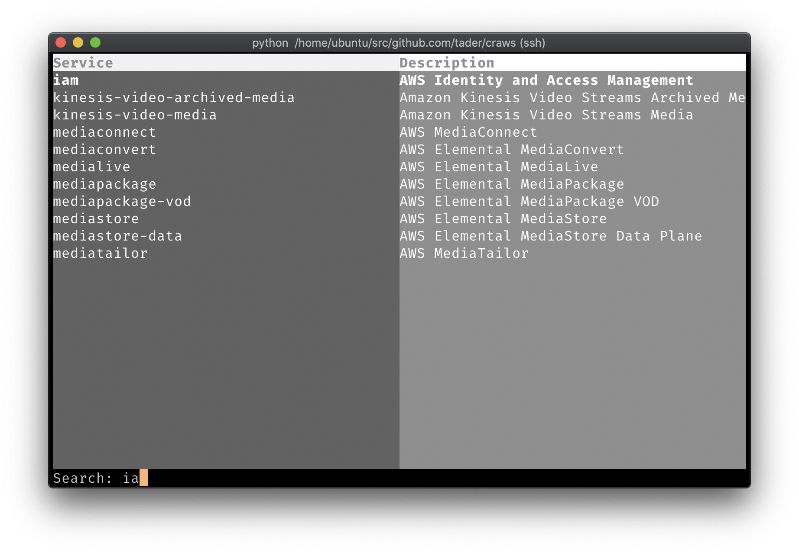

# Craws – An AWS resource browser for the CLI



Craws uses the aiobotocore session, so for authentication set your `AWS_DEFAULT_REGION` and `AWS_PROFILE` or `AWS_ACCESS_KEY_ID` etc...

This is currently an MVP, currently you need to:

```
git clone https://github.com/tader/craws
git clone https://github.com/tader/pytableview
pip install aiobotocore
export PYTHONPATH="$(pwd)pytableview:$PYTHONPATH"
cd craws
python -m craws
```
